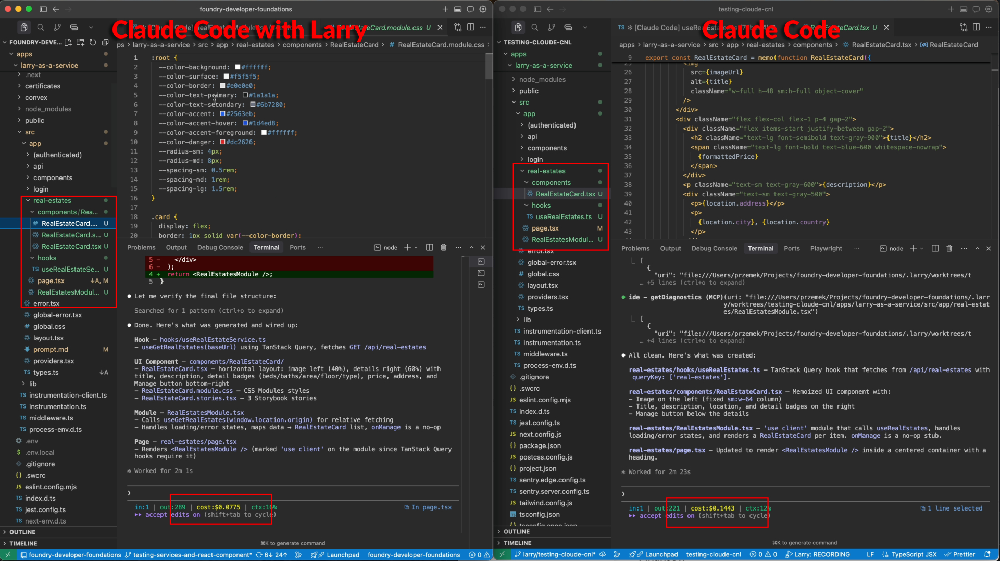

# Larry

Larry helps AI coding tools generate production-ready code through specialized generators instead of open-ended prompting alone.

It combines traditional generators such as schematics or Nx Devkit-based generators with encoded architecture standards and AST-based validation so cheaper models can reliably produce code that fits your codebase. The result is better consistency, lower token spend, and less review churn.

## Why Larry exists

Most AI coding workflows still ask a model to "figure out" your architecture from a mix of training data, partial codebase context, and whatever patterns it happens to notice in the current repo.

That works for simple tasks. It breaks down when you need code that is:

- consistent with your engineering standards
- structured the same way across teams and features
- cheap enough to use every day
- reliable enough to trust in larger codebases

Larry solves that by putting generators in the middle of the workflow.

Instead of asking a model to invent structure from scratch, Larry gives it a constrained path:

1. understand the generation intent through a schema
2. use templates and patterns encoded by senior engineers
3. generate code for a specific architectural target
4. validate and refine output with AST-aware checks

This is the important shift: AI is still involved, but it is no longer guessing the shape of the solution from scratch.

## What problems this solves

- Reduces variance in generated code across teams and sessions
- Makes code generation cheaper by enabling smaller, lower-cost models
- Encodes architecture standards once instead of repeating them in prompts
- Produces code that matches your file structure, naming, and patterns
- Lowers review overhead because generated code starts from approved templates
- Makes generators useful inside agent workflows, not just local scaffolding

## What Larry can generate

The generator stack behind Larry currently includes:

- `react` (created by the Codestrap team)
  - React components
  - React hooks
  - React modules
  - TanStack Query hooks
  - TanStack Form modules
  - TanStack Table modules
- `palantir` (created by the Codestrap team)
  - Compute modules
  - DAO generators
  - DAO delegates
  - Factory generators
  - Ontology generators
- more
  - We welcome senior engineers who want to contribute additional generators for stacks such as Next.js, Express.js, or other platform-specific workflows.
  - Reach out at `larry@codestrap.me`.

These generators are especially useful in opinionated frontend codebases where consistency matters as much as speed.

## Why generators plus AI beat prompting alone

Traditional generators are deterministic, but rigid. Pure AI generation is flexible, but inconsistent.

Larry combines both:

- generators provide the structure
- templates encode the standards
- AI fills in the intent
- AST analysis checks whether the output actually matches expectations

That combination is what makes the system both practical and economical. Instead of paying a premium model to rediscover your architecture every time, you encode the architecture once and reuse it across every generation workflow.

## React feature generation benchmark

In one Claude Code workflow using Sonnet 4.6, Larry reduced generation cost by about 50% and improved speed by about 20% compared with doing the same task through open-ended prompting alone.

### Code quality: Larry vs plain Claude Code

| Larry generators | Plain Claude Code |
| --- | --- |
| ✅ Generated from encoded templates and standards created by senior engineers | ❌ Generated from a mix of training data, partial repo context, and inferred local patterns |
| ✅ Produces predictable structure across files, modules, and naming | ❌ Can drift into inconsistent structure between similar features |
| ✅ Uses explicit architectural targets instead of guessing the desired shape | ❌ Often needs repeated prompt correction to align with project conventions |
| ✅ Lower cost because the model solves a narrower problem | ❌ More expensive because the model must infer more from scratch |
| ✅ Cost: $0.0775 | ❌ Cost: $0.1443 |
| ✅ Time to finish: 2min | ❌ Time to finish: 2min23sec |

Costs can be reduced even further with a custom Larry agent harness, because in the benchmark above we still used Claude Code, which means Claude was deciding what files to read and how to navigate the codebase even when that extra exploration was not needed.
In [Brainly's guided coding study](https://medium.com/brainly/from-vibe-coding-to-guided-coding-d2ba7e526ff3), a custom Larry workflow achieved about 97% cost reduction per task.

### Why opinionated architecture matters

AI works best when the target architecture is explicit. Without clear standards for structure, layering, naming, and code organization, generated code becomes inconsistent, harder to review, and more expensive to produce because the model has to infer too much on its own.

That is why Larry works best in codebases with an opinionated architectural model. When the architecture is defined, generators can encode it, and AI can follow it reliably instead of guessing.

If you are interested in a React example of this broader idea, read *React for Enterprise: Timeless Architecture for Enterprise Apps* by Przemyslaw Nowak, published with Nx:

- [React for Enterprise on Nx](https://nx.dev/blog/react-enterprise-book)

# Getting started

## Generate an API key

Larry API keys are issued through the Larry platform, and the token limits are intentionally generous for real day-to-day development work.

To create a key:

1. Open [Larry Dev Platform](https://larry-as-a-service.vercel.app/).
2. Sign in with your GitHub account.
3. Open the `API Keys` section.
4. Click `Generate key`.

## Ways to use Larry

### MCP plus Skills

Use Larry through MCP in your AI coding tool of choice, with tool-aware instructions and repeatable workflows.

- [Claude Code setup](docs/setup/mcp-skills/claude-code.md)
- [Codex setup](docs/setup/mcp-skills/codex.md)
- [Cursor setup](docs/setup/mcp-skills/cursor.md)
- [Antigravity setup](docs/setup/mcp-skills/antigravity.md)

### Larry CLI

Use the interactive schema-filling wizard to pick a generator, fill the required input, and write generated code to your project.

- [Larry CLI guide](docs/setup/larry-cli.md)

### Claude Agent SDK

Build your own Claude-based agent around Larry generators and orchestrate the generation flow yourself.

- [Claude Agent SDK guide](docs/setup/claude-agent-sdk.md)
- [Claude Agent SDK example](examples/claude-agent-sdk/README.md)

### Your own workflow

Import generator functions directly from the package and invoke them inside custom scripts, tools, or internal platforms.

- [Direct package usage guide](docs/setup/own-workflow.md)

## Authors

Larry was created by experienced engineers who have built and scaled developer platforms for large organizations, including Fortune 500 environments with hundreds of engineers.

<table>
  <tr>
    <td align="center">
      <a href="https://github.com/doriansmiley">
         
        <strong>Dorian Smiley</strong> 
        <code>doriansmiley</code>
      </a>
    </td>
    <td align="center">
      <a href="https://github.com/fasosnql">
         
        <strong>Przemek Nowak</strong> 
        <code>fasosnql</code>
      </a>
    </td>
    <td align="center">
      <a href="https://github.com/kopach">
         
        <strong>Igor Kopach</strong> 
        <code>kopach</code>
      </a>
    </td>
    <td align="center">
      <a href="https://github.com/fricze">
         
        <strong>Andrzej Fricze</strong> 
        <code>fricze</code>
      </a>
    </td>
    <td align="center">
      <a href="https://github.com/bcodestrap">
         
        <strong>Ben Rogojan</strong> 
        <code>bcodestrap</code>
      </a>
    </td>
  </tr>
</table>